# OKR学习
## ORK快速入门
- 对于O，需要做到以下三点：
1. **方向明确：** 目标不能太抽象，也不能混淆不清，要让每个人都能看懂
2. **目标对齐：** 下级要对齐上级的目标，即向上对齐，平级还要相互对齐，即水平对齐
3. **时间限制：** 目标需要有时间边界，不能遥遥无期，而且时间边界要恰到好处
> 例如：“做一家成功的企业”这样的 O 就不满足要求，因为它的方向不不够明确，也缺乏时间限制，什么是成功？需要多长时间才能成功？...

- 对于KR，需要做到以下三点：
1. **有挑战性：** 关键结果要有挑战性，拒绝平庸，拒绝不切实际，要做到“挑一挑，就能够得着”。
2. **容易度量：** 无法度量的关键结果是没有任何意义的，宁可抛弃
3. **不是任务：** 关键结果需要对目标产生直接影响，它不是日常任务，也不是行动计划

> **_总地来说,指定OKR需要遵循“SMART原则”，需要尽可能的满足以下五个要求：_**
>- Specific：具体的 
>- Measurable：可度量的
>- Attainable：可实现的
>- Relevant：有相关性的
>- Time-bound：有时间限制的

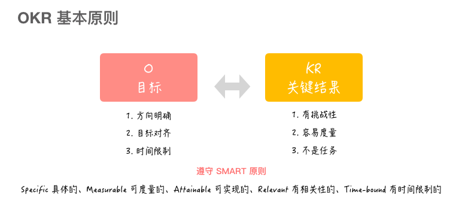
> 一个OKR可以对应多个O，每个O又可以包含多个KR。可见，O 和 KR 之间是“一对多”的
关系。既然 OKR 需要考虑时间限制，那么 O 就不应该设置太多，最多不要超过 3 个，否则就容易导致精力有限，不够聚焦...
同样，每个 O 所包含的 KR 也无需太多，最多也不要超过 3 个。如果你需要做到绝对聚焦，那么就使用 1 个 O 吧，因为其他的 O 通常都是多余的。


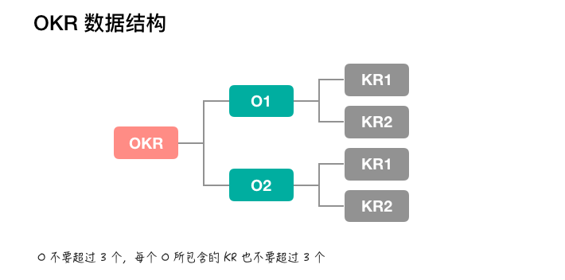

### OKR举例
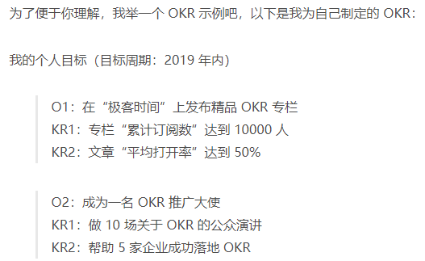

### 使用OKR的三板斧
1. **指定OKR：** 自顶向下地制定目标，自底向上对齐目标
2. **指定OKR：** 唯有做到持续追踪、持续更新，才能做到拥抱变化
3. **评估ORK：** 周期性地评估和复盘，持续改进、持续迭代

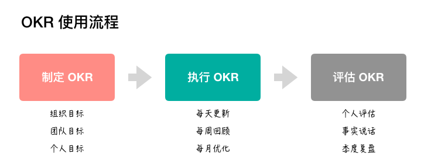

> 可见，**OKR 不是静态不变的，而是动态可变的，** 这一点和“敏捷”有异曲同工之妙，它们都是为了拥抱变化，其精髓都在于，在 Volatile（不稳定）、Uncertain（不确定）、Complex（复杂）、Ambiguous（模糊）的“VUCA 时代”下，OKR 能帮助企业获得商业上的成功。
### OKR 和 KPI 的区别
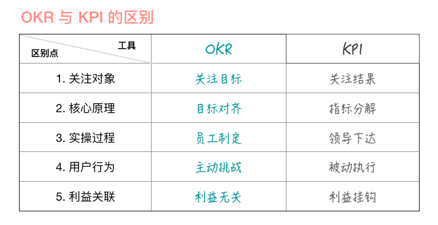
### OKR 有效推广建议
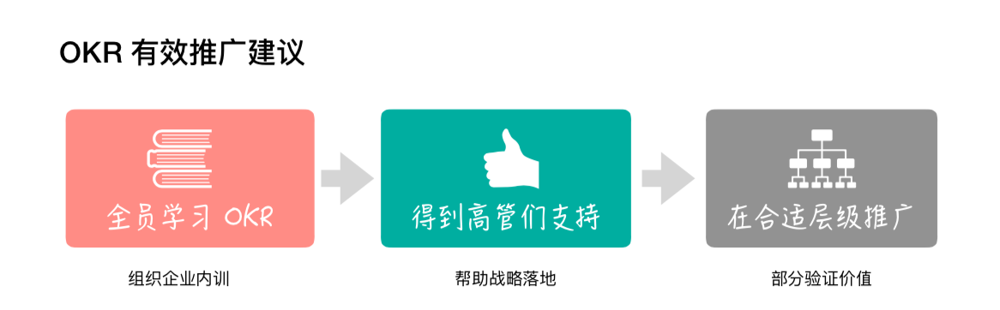
> 在企业推广OKR时，请务必记住以下三点：
> 1. 一定不要强制性地去推广OKR，更不要在大家概念不一致的情况下就大规模退矿OKR
> 2. 当大家对OKR理解不一致时，一定要请外部OKR专家到企业内部做OKR培训，才能快速建立共识
> 3. 要充分发挥你的领导力去影响身边的人，让高管们对OKR表示认同，让团队成员们尝到OKR的甜头，这才是我们作为领导者需要去做的事情
### 打造内驱力团队文化的三点实战心得

### 总结
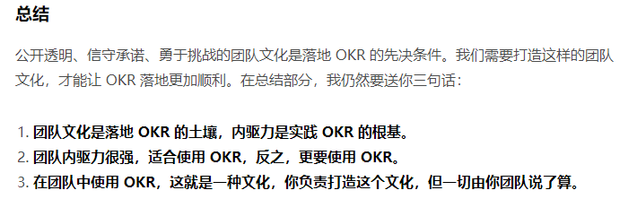
### ORK快速入门框架图
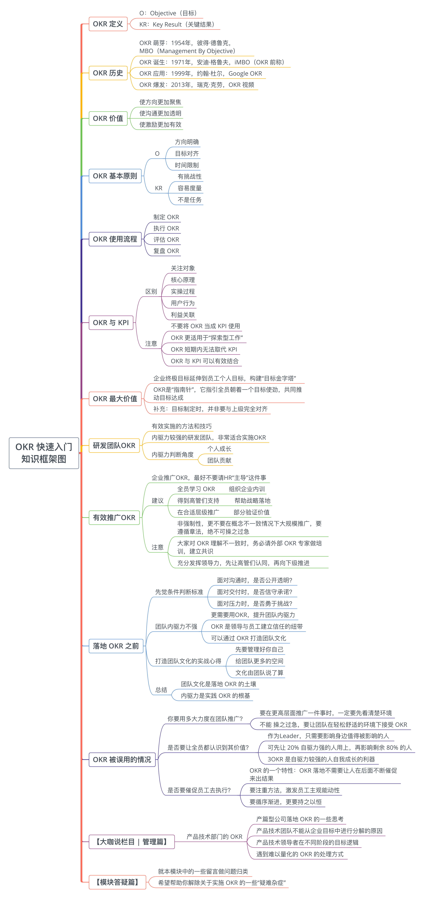
## ORK操作指南
### 如何判断制定的 O 对不对
> O是ORK中“What”的层面，它解决了“做什么”的问题  //O 是定性的，
- 制定O时需要注意以下三条核心原则：
1. O 要有实际价值，你要深度思考。
2. O 要能激励人心，你要善于表达。
3. O 要短期可实现，你要脚踏实地。
- 三条注意事项：
1. O 尽可能要以动词形式开头。例如：打造……、建设……、实现……。
2. O 用通俗易懂的语言来表达。一定不要写一些自认为“高大上”的词汇，除非大家理解上都可以达成一致。
3. O 最好能附上一句目标描述。建议为 O 增加一句话描述，就“为何我要写这个目标？”这一问题，来向大家讲解。
```
示例：
    2019 年 Q1 团队目标
    O1：打造能让每个人都喜爱的工程师文化
    描述：希望能提升工程师团队的凝聚力，让每个人在团队中都能得到成长，并为加入我们的团队而感到骄傲因此，我希望大家能一起打造让我们团队每个人都喜爱的文化。

示例：
    2019 年 Q1 个人目标
    O1：实现一套可用于生产环境的自动化部署框架（向上对齐“团队目标 -O1”）
    描述：让不断重复的人工部署操作自动化，提高工程效率，将模式性的工作交给机器去做，让人去做更有智慧性的工作，力求打造出“自动化”工程师文化。
```
### 如何判断制定的 KR 对不对
> KR 是针对 OKR 中“How”的层面，它解决了具体“怎么做”的问题。 //KR 是定量的。
```
用数据说话
判断点的关键在于：就看 KR 中是否有“数字”，是否具备“用数据说话”这一特性。

具备挑战性
如何判断自己制定的 KR 能“跳一跳就能够得着”?
    关于 OKR 的一个重要工具——信心指数,它用于呈现自己对每项 KR 的信心程度，一般可通过分数形式表示
    比如，0/10 表示没有信心，5/10 表示有五分信心，10/10 表示有十分信心。在制定 KR 时，建议按照 5/10 的信心指数来制定，即“跳一跳就能够得着”的状态。

对目标职称
当你每制定出一条 KR 时，就要问自己一个问题“这条 KR能支撑它的 O 吗？”，又或者“假如这条 KR 实现了，能真正反映出它所对应 O 的完成率吗？”，如果这个问题的回答为“是”，那么你就值得将这条 KR 写下来
```
- KR需要遵循的三条核心原则，按照重要程度依次排列
1. KR 要支撑目标，需要与 O 直接关联。
2. KR 用数据说话，需要通过数据去度量。
3. KR 具备挑战性，难易度设置需要恰到好处。
- KR 的三点注意事项
1. KR 需要通过努力才可能完成。可能是实现难度较大，或者是它的时间成本较大。
2. R 不是日常工作或行动计划。实际上，KR 是完成一系列任务后才能得到的结果。
3. KR 必须要具备良好的实操性。当写完一条 KR 后，试着经常问自己“这条 KR 应该如何去...
```
示例：
    2019 年 Q1 团队目标
    O1：打造能让每个人都喜爱的工程师文化
    KR1：发布 1 份经团队认可的《工程师文化宣言
    KR2：完成 3 种不同形式的工程师活动并全部复盘

示例：
    2019 年 Q1 个人目标
    O1：实现一套可用于生产环境的自动化部署框架（向上对齐“团队目标 -O1”）
    描述：让不断重复的人工部署操作自动化，提高工程效率，将模式性的工作交给机器去做，让人去做更有智慧性的工作，力求打造出“自动化”工程师文化。
```
### ORK制定技巧
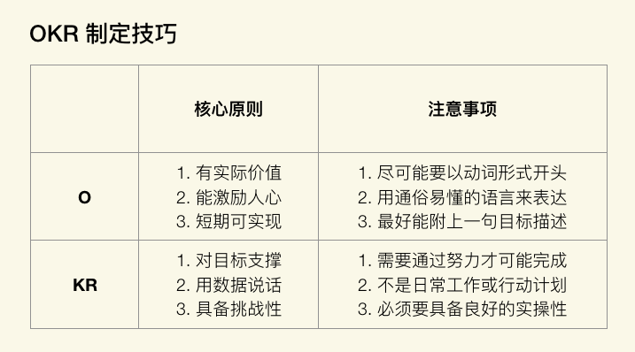
### 总结
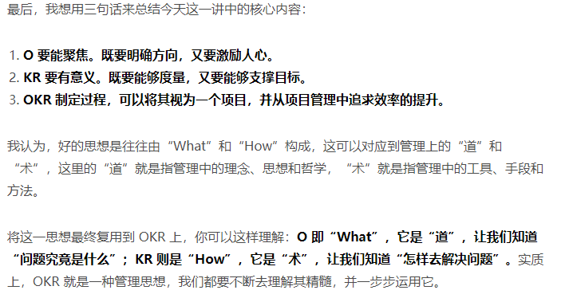
### 总结
需要设定“信心”指数:
- 1.0 分：不可能做到，但实际做到了.信心指数：<10%
- 0.7 分：希望能做到，实际也做到了.信心指数：<50%
- 0.3 分：肯定能做到，实际也做到了.信心指数：<100%
- 0 分：肯定能做到，但实际没做到.信心指数：<100%
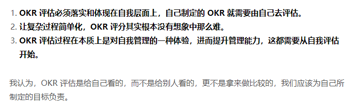
### 什么是ORK复盘
1. 审视目标
2. 回顾过程
3. 分析得失
4. 总结规律
### 总结
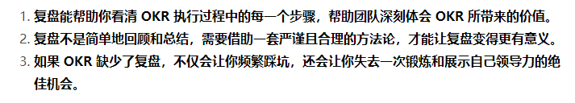
### 攥写OKR小技巧
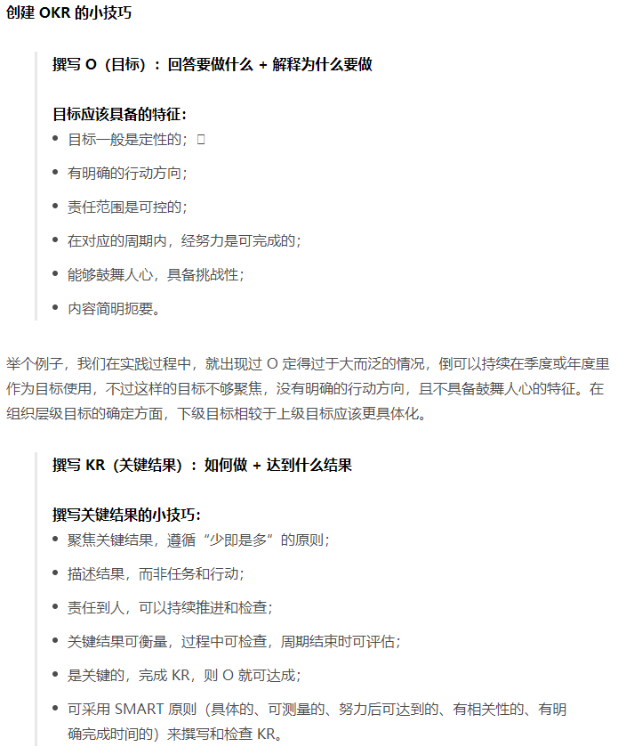
### 总结

### OKR操作指南知识框架图


### 快速得到O
```
需要知道领导这么说的目的是什么，要做什么，这个就是O
当领导说出对团队执行力的期望，其实也是领导对你的期望，也就是接下来你要努力的方向，而此时 OKR 的 目标（O）也就诞生了。

```
### 判断KR是否具有挑战性
- 这是你过去没有做的事吗？这个 KR 完成的把握有多大？这个完成的难度在哪里？

### 如何计算研发团队人效
- 第一步：针对所有的研发岗位，制定出对应的岗位级别与人力系数。
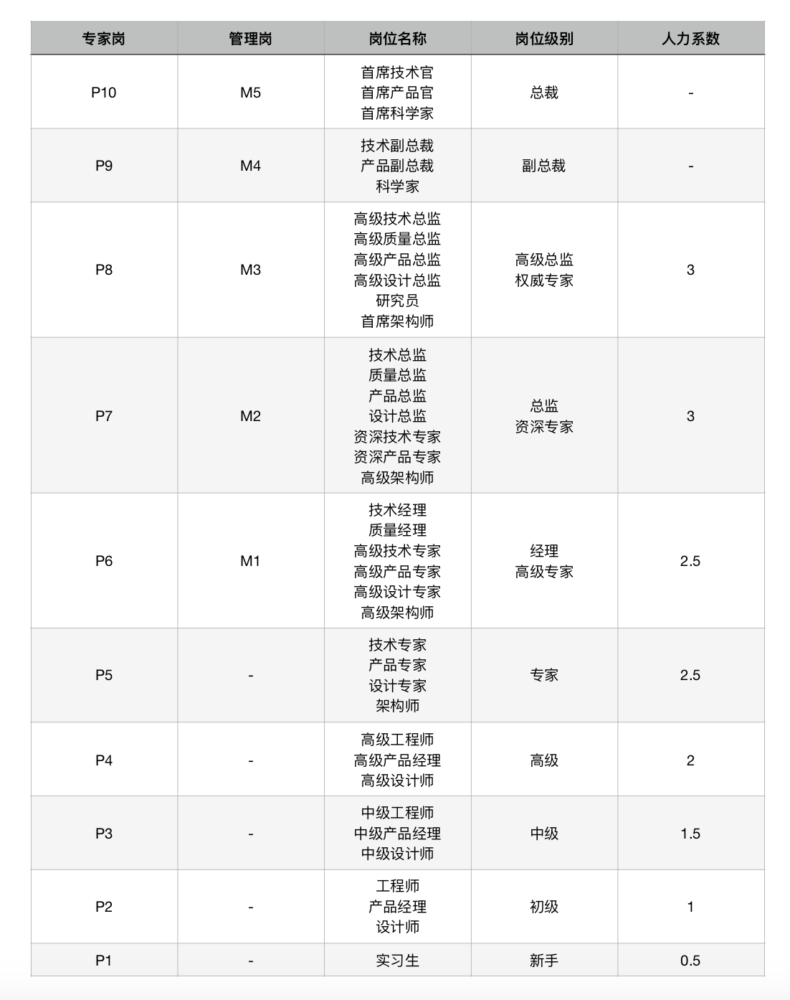
- 第二步：针对项目的难度级别，分别对应其设置难度系数。
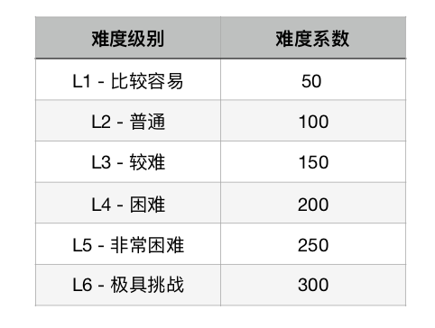
- 第三步：根据实际投入情况，计算研发团队人效。
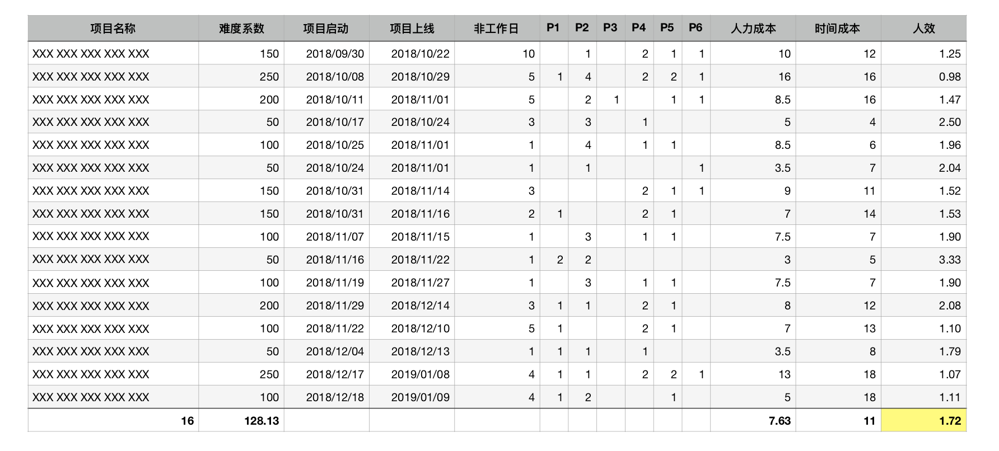
- 涉及到以下几个计算公式，需要加以说明：
> - 时间成本 ＝ 项目上线 － 项目启动 － 非工作日
> - 人力成本 ＝ ∑ (人数 × 人力系数)
> - 人效 ＝ 难度系数 ÷ (人力成本 × 时间成本)
```
要想提升人效，在难度系数不变的情况下，需要降低人力成本的投入，或者降低时间成本的消耗。
```
## OKR管理心经知识光甲图
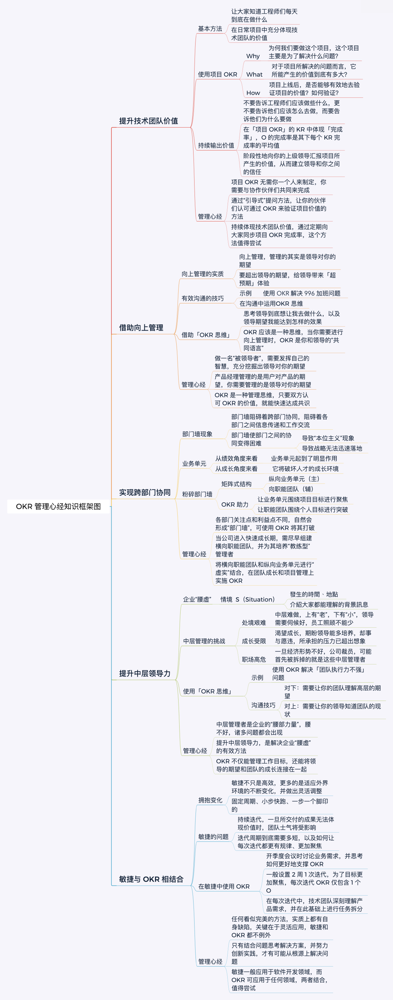
## 告别无意义会议，会议6要点
https://time.geekbang.org/column/article/127199
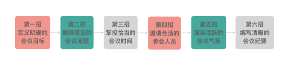
## OKR的十个坑！！！
https://time.geekbang.org/column/article/128058
## 如何灵活应用OKR
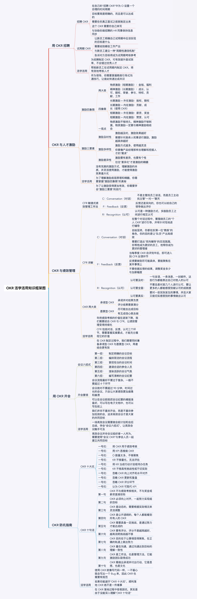
## 如何评判一个OKR是否完备
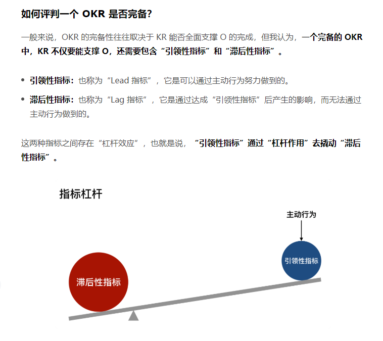
### 案例
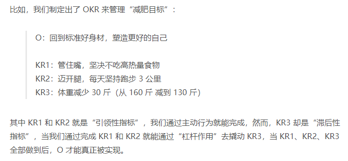
