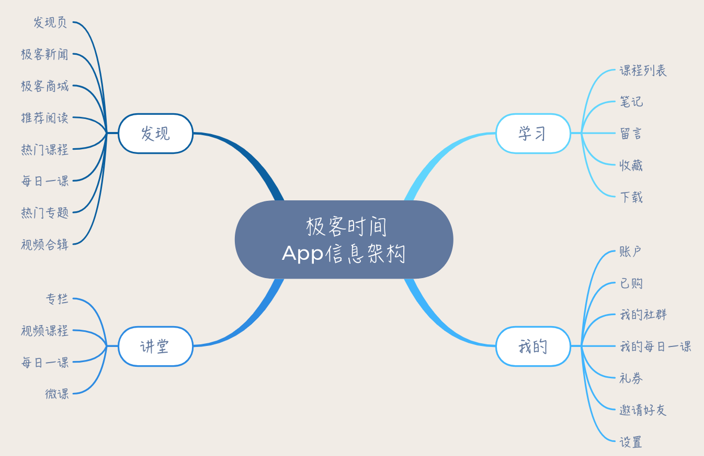
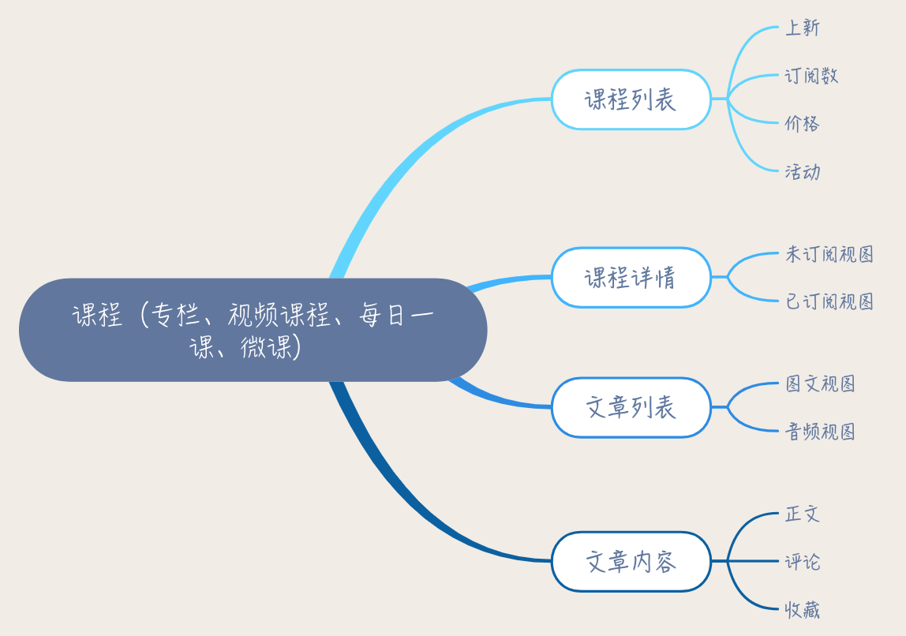
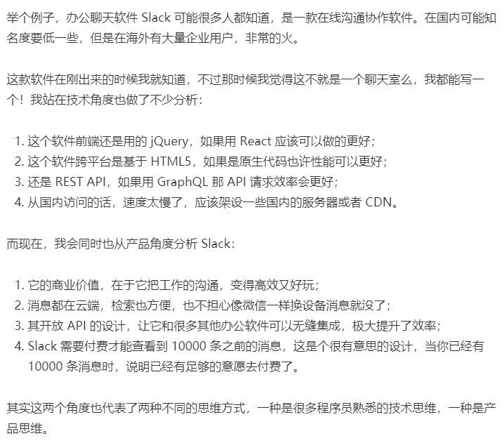

# 软件工程
## 什么是软件工程
- 软件工程三要素

- 软件工程

## 开发模式
### 瀑布式开发
- 没记录
### 敏捷开发
- 每日站立会
  - 昨天做了什么
  - 今天计划做什么
  - 遇到了是嗯么问题
- 使用看板来进行管理（用户故事）
  - 开发人员自己领取用户故事自行开发
  - 自己编写测试用例
- 发布
  - 使用CI
  - 使用自动化测试和自动化发布
- 每周一部署开发环境
  - 因为出了问题 周末就不要想着休息了
- 每周二开迭代回顾会议，总结上个 Sprint
  - 总结团队好的地方，和不好的地方，都说出来
- 每周四迭代规划会，，计划下周工作
  - 将要做的拿出（按照优先级）让所有人参与打分，比如需要多少时间才能做完。
- 每周五分支切割


##  怎样平衡软件质量与时间成本范围的关系？

从时间、成本和范围这三条边中找出来固定的一条或者两条边，再去调整另一条边。
# 项目规划
## 可行性分析
- 及时止损
- 针对一下方面进行分析：
    - 经济可行性分析：
     > 从成本和收益角度分析，看投入产出比。不仅要分析短期利益，还要分析长期利益，看是不是值得做。
    -  技术可行性分析：
     > 软件项目最终是需要人通过技术来实现的，所以要分析技术上是不是可行，如果有技术上解决不了的问题又能否规避。
    - 社会可行性分析：
     > 社会可行性涉及法律、道德、社会影响等社会因素。比如，触犯国家法律的事情肯定不能做；产品如若不符合道德标准，可能带来较大的社会负面影响，那么也要慎重考虑。
    ### 案例
    
    
    
    

## 怎么管好软件项目中的事
1. 选择合适的开发模式，还需要配套的流程规范
   - 瀑布式
   - 敏捷开发
   - 极限开发
   - 迭代模型
2. 制定好项目计划
    - 凡事预则立不预则废，在选择好开发模式后，紧接着就是要做好项目计划，有了项目计划，才能有计划有目的地去推动项目进展，出现问题也能及时发现、及时调整。
3. 对计划进行跟踪和控制，同时做好风险管理
    - 需要有Plan B。
  


## 项目计划

- 制定计划分为三部：
  - 第一步：任务分解
  ```
  在项目管理中，对任务分解有个专业的词汇叫 WBS，它意思是工作分解结构（Work Breakdown Structure, WBS)。就是把要做的事情，按照一个树形结构去组织，逐级分解，分割成小而具体的可交付结果，直到不能再拆分为止。
  ```
    
  - 第二部：估算时间
  ```
    要想估算准确，需要从两个方面入手： 
    1. 任务拆分的越细致，想的清楚，就能估算的越准确。
    2. 要让负责这个任务的人员参与估算。
  ```
    
  - 第三步：排任务路径
    - 排路径就是要根据任务之间的关系，资源的占用情况，排出合适的顺序。
    
- 设置里程碑
  - 里程碑的时间点确定后，计划可以灵活调整，但里程碑一般不会轻易改变，因为里程碑代表着一份承诺。这对于项目成员来说，有两个重要的影响，一方面，成员会有很明显的来自 DeadLine 的进度压力，自古 DeadLine 就是第一生产力；另一方面，就是在里程碑完成后，大家会获得一种正面激励。
- 计划需要跟踪和调整
    - 可以了解计划的执行情况，了解成员的工作情况，是否能按时完成，需要什么样的帮助。
    - 跟踪进度的方式主要有两种：
      - 项目经理定期收集跟踪：有一个沟通确认的过程，对进度会了解的更准确
      - 项目成员主动汇报：可以减少项目经理的收集工作，但有可能不准确
  
    - 敏捷开发的两个实践特别值得借鉴和推广
      - 第一个就是每日站立会议，在每天的站立会议上，每个项目成员都需要说一下自己昨天做了什么，明天计划做什么，有没有什么阻碍。通过这种方式，可以非常好的了解每个人的任务进展情况，同时对于成员遇到的困难，其他人也可以及时给予支持。
      - 通过看板，可以非常直观的看到每个人在干什么，进展如何。
## 流程和规范
- 为什么要有流程规范？
  - 提升团队效率
  - 将好的实践标准化流程化，让大家可以共享经验
- 借助流程规范，让项目管理从人治到“法治”
  - 问题点：过于依赖人的管理，项目经理就会成为瓶颈，大事小事都需要项目经理来决策。再说项目经理也不能保证每次决策的正确性，如果决策失误，会很可能导致一些冲突。
  - 好的项目管理，不需要直接管人管事，而是管理好计划和流程规范；项目成员不需要按照项目经理的指令做事，而是遵循计划和流程规范。
- 如何制定好流程规范？
  - **第一步：明确知道你要解决什么问题**
    
  - **第二步：提出解决方案**
    
  - **第三步：达成共识，推广执行**
    
  - **第四步：持续优化，不断改进**
    
## 开会
- 评审会议
- 通过会议
- 每日站立会议
- 项目立项会议
  - **项目目标：**这项目是要干什么的，达到一个什么目标；
  - **项目里程碑：**项目的开始结束时间，项目的阶段划分，以及各个阶段的时间点；
  - **角色分工：**项目成员的分工和角色是什么，每个人知道自己的任务是什么，知道遇到问题该找谁；
  - **流程规范：**项目开发的主要流程是什么，基于瀑布还是敏捷。
- 项目总结会议
  - 团队成员可以一起总结一下项目的得失，把经验总结下来，帮助团队在下一次做的更好。
### 什么样的会议是有效率的？
- 会议是不是有效率，取决于它创造的价值是不是高于其成本。
### 如何提高开会效率？
- 其实提高开会效率、提升开会价值的方法，就跟软件项目金三角的理论一样，只要从两个角度去想办法：**减少开会的成本，增加开会创造的价值！**
  1. 砍掉一些没价值的会议
    - 没有目标的会议。大家都在随意发散，完全没有主题；
    - 不能形成决策，没有会后行动。如果一场会议看完后都没有什么结果，那跟没开都没啥差别；
    - 你属于可有可无的角色。如果一个会议，跟你其实没什么关系，你无法提供有效的反馈，对你也没什么价值，只不过是被人拉过去开会的，那不如把这个时间用来做一点对项目更有价值的事。
  2. 减少参与会议的人
    > 会议的成本和两个因素相关：一个是人数，一个是时间。如果减少人人数，就能减少成本。
  3. 缩短开会时间
    - 比如说站立会议，通过站立的方式逼着大家快点结束。
    - 比如敏捷开发中的如有偏离主题的会议，放入“停车场问题”环节。
  4. 提升会议所创造的价值

## 风险管理
- 凡事都应该有B计划
### 什么是风险管理？
- 风险是指不确定的时间，一旦发生，将会造成消极的影响，风险包含两个方面的内容:
    1. 发生后，会造成什么样的损失
    2. 发生的概率有多大？
    > 所以有人认为：风险 = 损失 * 发生概率
    > 风险管理就是指在项目进行过程中，识别可能的风险，对风险进行评估，并加以监控，从而减少风险对项目的负面影响
### 风险管理重要吗？
>**对软件项目风险的管理，才是体现项目管理水平的地方**
### 如何做好风险管理
#### 培养风险意识
项目中的任务，不能盲目乐观，都思考一下它最坏的结果是什么，如果最坏的结果不能接受，就说明要有个报计划，考虑风险管理了。
#### 如何对风险进行管理，分为以下四步来做
**第一步：风险识别，识别可能的风险**
> **10个项目死亡的信号**
> 1. 第一版做太多功能；
> 2. 太依赖新技术平台；
> 3. 与公司另一个有份量的产品竞争；
> 4. 团队人手不足；
> 5. 复杂的问题，需要负责的解法；
> 6. 成员开始隐藏进度落后的事实和原因；
> 7. 不管更改、增加的需求；
> 8. 2.0症候群 - 非要更大、更强、更美；
> 9. 产品没有市场立足点；
> 10. 你根本无法解决的大问题。

一个识别风险的方法叫**检查表法**,就是可以把类似于上面这些常见风险手机整理起来，分类列成清单，按照清单去检查对照。

##### 软件项目的风险主要分成以下几类：
- 项目风险：项目预算、进度、用户和需求等方面的问题
- 人员风险：人员离职、人手不足等问题；
- 技术风险：采用的技术所可能带来的风险；
- 商业风险：与市场、产品策略等有关的商业风险。

**第二步：风险量化，对风险进行评估量化**

在风险识别出来以后，需要从过来那个方面去评估：
- 发生的概率多大？
- 发生后，后果多严重？

对于概率大，后果严重的风险，需要高优先级重点考虑；
对于概率不高但后果严重的问题也要考虑，不过优先级略低；
对于概率高但后果不严重的风险事件，可以优先级很低或者不考虑；
对于概率低后果不严重的，则可以不予考虑。

**第三部：应对计划，对风险指定应对策略**
```
                      损失大
                        |
          转移风险       |     回避风险
                        |
                        |
可能性小------------------------------>可能性大
                        |
          接受风险        |    缓解风险
                        |
                        |
                      损失小
```
- **回避风险---更改导致风险的方案**
  
  放弃或者修改导致风险的方案。

- **转移风险----将损失转嫁出去**

  为了避免承担风险损失，将损失转嫁出去。

  ```
  例如：你的团队对于服务器管理不是很在行，有可能会遇到服务器宕机或数据库丢失数据等风险，就可以考虑购买云服务，这样云服务上会帮你解决服务器宕机或数据库丢失的问题，而且万一宕机或丢数据了他们也会承担一定的责任。
  ```

- **缓解风险----降低风险发生概率或减少可能造成的损失**

  就是在风险发生前采取一定措施，降低风险发生的概率，或者减少风险可能造成的损失。

  ```
  比如你要担心数据库数据丢失的风险，就需要定期备份数据库；比如你担心核心成员要离职，那就涨点工资，避免人才流失。
  ```

- **接收风险----明知山有虎，偏向虎山行**
  因对这个风险的成本超过风险发生后造成的损失，那么就没必要应对，直接选择承担风险后果就好了。

**第四步：风险监控，对风险进行监控预警**

### 写好项目文档
- 从模仿开始
- 从小文档开始
  - 项目中很多文档都可以从这样小的内容开始：别人给你讲一个问题的时候记录下来；你给别人讲一个问题的时候记录下来；解决一个技术难题时记录下来方案…
- 从粗到细，迭代更新
  - 我写一个大一点的文档，都是从脑图开始的，先基于脑图，把基本结构梳理清楚。然后第二步就是写 PPT，PPT 有个好处就是不用太多文字，列个一二三，画几张图，就是个简单的文档，PPT还有个好处就是可以用来给别人讲解，收集反馈。
- 一些基本的画图技巧
  - 线框图
  - 流程图
  - 时序图
  - 各种格式截图

# 需求分析

## 需求分析过程
### 第一步：挖掘真实需求
分析用户的真实需求，可以从三个角度入手：
1. 目标用户：用户不同，诉求也不一样
2. 使用场景：使用场景不一样，解决方案也会有所不同
3. 想要解决的问题：用户背后想要解决的问题是什么

（案例：福特汽车、荡秋千）
### 第二步：提出解决方案
结合产品定位，提出相应的解决方案（案例：福特汽车、荡秋千）
### 第三步：筛选和验证方案
验证方案，确保方案能解决用户需求 

## 怎样做需求分析
### 主要经过三个步骤
- 第一步：挖掘真实需求
- 第二步：提出解决方案
- 第三部：筛选和验证方案

软件项目的用户需求，从来不是单一的，而是一系列需求，所以对于软件项目的需求分析，还需要增加收集整理的步骤。整个过程是迭代进行的，如下所示：
- 收集需求：对用户需求进行收集整理；
- 分析需求：对需求进行分析，挖掘用户真实需求；
- 需求评估：筛选过滤掉不可行的需求；
- 需求设计：针对用户需求提出解决方案，设计成产品方案；
- 验证需求：验证方案是否可行
  
  
#### 1. 收集需求
方法很多，需要自己思考，以下列举部分：
- 头脑风暴：就是大家一起开会头脑风暴讨论；
- 用户调研：通过调查问卷或者访谈，通过问用户一些问题收集反馈；
- 竞品分析：通过分析其他同类产品的功能获得需求；
- 快速原型：通过原型来收集反馈，收集确认需求。
#### 2. 分析需求
收集了需求，就要分析用户的真实需求，这是最难的部分，也是最体现PM需求分析水平的地方，

用户需求背后的真实需求有三个层次：
- 表层需求：用户对解决问题的期望，例如马车更快
- 深层需求：用户的深层次动机，诉求产生的原因，例如乘客对出行速度的要求
- 底层需求：人性的本能的需求，例如对安全感对舒适的追求

要分析好用户需求背后的真实需求，就是要结合”目标洪湖“和”使用场景“，按照上面三个层次去思考。

#### 3. 需求评估
需求收集分析完了后，还需要进一步评估，以决定做还是不做，优先级如何，先做哪些再做哪些。

需求评估考虑的因素有：
- 可行性：技术能否实现
- 成本：人力成本、时间成本
- 商业风险和收集：有没有商业上的风险，收益是否合理
- 紧急性与重要性：是不是用户迫切需求的

简单访问就是用“紧急重要四象限”:


复杂一点有KANO模型：


#### 4. 需求设计
在分析和评估完需求后，还需要提出解决方案，也就是对需求进行设计，做出来有效的产品设计方案。最终的产品设计，会落实到人际交互上面，用户可以通过软件界面交互。可以借鉴很多别人的产品。

#### 5. 验证需求
在需求设计好后，还需要进行验证，看解决方案是否能满足用户的需求。

对需求的验证方式其实是贯穿整个软件项目生命周期的，在相求分析阶段，会反复验证确认设计好的需求是否满足用户的真实需求，例如各种设计评审，

在产品开发完成后，也需要有需求的验收，以确保开发出来的软件产品是客户想要的，满足客户需求的。

现在很多互联网产品，还有一种基于数据的验证需求方式，也就是A/B测试

设计好一个功能上线后，并不直接让所有用户使用，而是先给一小部分用户使用，然后分析数据，看使用这个功能的用户群和不使用这个功能的用户群，在营收、访问量、活跃度等关键数据上是更好还是更坏。如果好，就加大比例，如果数据不好，可能就会调整甚至取消这个公。

在需求分析完成后，就可以基于需求分析形成文档，进行设计和开发了

## 原型设计
### 怎么做好原型设计？
> 可以借鉴《工程法》的方式:分析、设计、实施和验证
#### 第一步：分析
在原型设计时，通常属于需求的最初阶段，需求还是很模糊、不具体的。所以这个阶段首先要做的，就是要对用户的需求有个初步的了解，分析清楚原型设计的目标是什么。
#### 第二步：设计
在对需求进行初步分析后，需要开始对原型进行整体设计。在设计阶段，主要从两个维度来考虑：
1. 从信息架构的维度，考虑清楚整个产品的信息架构，划分出模块；
2. 从更实用流程的维度，考虑清楚界面之间的流程。
#### 画产品的信息结构图
产品的信息结构，就像一本书的目录，整体描述了架构信息。
例如：极客时间APP


#### 画产品的使用流程图
需要用流程图把界面之间跳转的逻辑梳理清楚，除了正常使用流程，异常情况也需要考虑进去。
#### 第三部：实施
在设计好整体的信息架构和使用流程图后，就可以开始对每个界面画流程图了

在具体到界面是，**要优先考虑满足产品需求，然后是然该界面好看好用**
#### 第四部：验证
PM自己反复验证几遍，如果发现有流程上走不动或者使用不方面的地方自己调整。

针对原型设计，需要有响应的评审会议，让大家提出反馈，根据反馈在做出调整。

### **如何祖选择合适的原型设计工具**

- 面向的平台：Web、桌面、手机
- 保真度：中度保真度还是高保真度
- 功能：是否满足的要求
- 成本：价钱是否可以接受

以下推荐几款原型设计工具：

**Axure RP：** 优点：可以制作网站、桌面软件、移动App的原型。缺点是专业度较高，价格较高。

**墨刀：** 优点：制作网站、桌面软件、移动App的原型，上手容易，价格比Axure便宜。

**Adobe XD：** 是Adobe出的一款设计兼原型设计工具，可以制作出高保真原型，对于设计时尤其容易上手。

**ProtePie：**是一款高保真原型设计工具，不需要编程基础，可以做出逼真强大的交互效果

**Framer X：** 是一款高保真的原型设计工具，功能很强大，但是需要一定的编程基础，尤其适合程序员使用。

#### 总结
做好原型设计，可以结合工程方法，分成四个阶段：分析、设计、实施和验证
- 分析阶段，搞清楚用户的需求，原型设计的目标。
- 设计阶段，划分好产品的信息架构，设计好产品操作的流程。
- 实施阶段，按照设计的结果，对每个界面制作原型，并做好界面之间的连接；
- 验证阶段，和项目成员、客户进行确认，收集意见反馈，根据反馈进行修改。

## 程序员的产品意识
### 第一，你的价值体现在你所做的产品之上
也就是说，你所做的产品越有价值，你的价值就越大，相应的工资就也会高

所有**程序员的价值，并不完全体现在技术上，而在于用技术做成了产品，产品创造了价值，在回过头来成就程序员的价值**

### 第二，你的价值体现在团队中的稀缺性
- 有的程序员能搞定别人搞不定的技术难题
- 有的擅长培训新人
- 有的擅长和业务不跟沟通
- 有的高质量地完成功能模块
- 有的能按照需求设计好的架构，可以让团队高效率低成本地完成需求

#### 什么是产品意识
> 产品意识，本质就是一种思维方式，一种站在产品角度思考问题的方式。如果细分一下，产品及时包含：商业意识、用户意识和数据意识
#### 商业意识
所谓商业意识，就是所做的产品是要有商业价值的。如windows、iphone、goole，这些不仅满足用户需求，同时也能创造商业价值，让这些公司变成成功的商业公司。

商业意识的另一方面其实是成本，成本意识容易被程序员忽视。比如：
- 有时候为了炫技，采用了更难更酷的技术方案，而忽视了所采用的方案会导致很高的开发成本；
- 花了太长时间去开会而忽略了开会的成本；
- 有时候又为了省钱，舍不得买一些成熟的商业组件或服务，反而是浪费了更多成本。

如果程序员有商业意识，就可以在项目中有更好的成本意识，为项目节约时间、经济等成本，帮助团队打造更有价值的产品。

#### 用户意识
所谓 用户意识，就是说做产品是，你要能挖掘出用户的真实需求，让产品有好的用户体验，这需要你要有同理心，能站在用户的角度去思考和体验产品。

没有用户意识，举例说明：
- 一个产品功能，产品经理在细节上没有定义清楚，程序员可能并不会主动提出，最终做出来的产品会不好用；
- 在做技术方案时，更追求技术炫酷，而不是用户体验更好；
- 在设计接口时，并没有考虑调用者的便利性。

多一点用户意识，想到的问题将会多很多维度， 比如说：
- 能让自己的负责的模块有更好的体验；
- 让自己的技术方案更好地满足用户需求，用户更满意；
- 让自己设计的接口、API 更好用，与同事愉快合作。

做到这样，无论对产品还是对自身，都是价值的提升
#### 数据意识
所谓数据意识，就是在产品设计、产品运营时，通过数据来发现问题、证实结果。

典型的有A/B测试

> 在商业意识、用户意识和数据意识上去多思考，就可以帮你在项目中做的更好

### **如何培养产品意识？**
那么程序员要怎样培养产品意识呢？要培养产品意识，其实和程序员转管理的类似，首先要解放思想，然后要改变习惯，最后要多实践。

#### 首先要解放思想
解放思想，其实就是说，对于程序员，不要总是单纯的用技术眼光看问题，也可以从产品的角度看问问题。这两者有什么区别呢？


> 技术思维会关注用什么技术，关注技术细节，关注功能“如何”实现；产品思维会关注用户体验，关注一个功能所创造的价值，会去思考为什么要或者不要一个功能。

#### 然后要改变习惯
- 在日常使用产品、开发产品的时候，多站在产品的角度思考，去思考它的商业价值、用户体验、使用场景等等。 

## 需求变更

### **方案一：增强需求变更流程，让需求变更规范起来
通过严格的流程，来避免一些没有意义的变更，从而达到管理需求变更的目的。

### **方案二：快速迭代，缩短版本周期**
就打的功能拆分，每个周期实现一部分功能需求。

### **为什么建筑工程中少有需求变更**
主要由两个主要原因：**需求的确定性和需求变更的成本**

#### 原因一：需求的确定性


#### 原因二：需求变更的成本
需要明白需求变更所带来的成本，如更改代码会然个测试代码也会一起更改

### **如何解决需求变更的问题**
- 提升需求确定性，把需求分析做好，减少需求变更
- 提高需求变更的成本，然给客户或者产品经理不能太容易就变更需求，这样就可以达到减少需求变更的目的
- 降低响应需求变更的成本，可以方便快捷地响应需求变更

#### 项目中需要的文档
```
已经写好项目文档，但想更另一步优化文档，老师可以分享一下项目中需求规格说明书、概要设计、详细设计、代码规范文档、测试文档、部署文档等的优秀具体案例吗？

我在文中附了一个开源项目的链接：https://video-react.js.org/

产品需求文档模板：https://www.jianshu.com/p/e89e97858be1

微服务，从设计到部署： https://docshome.gitbooks.io/microservices/content/2-using-an-api-gateway.html

```
项目立项：
- 原始需求文档
- 可行性分析报告
- 立项说明书
  
需求相关的  
- 原型设计文档
- 产品设计文档

系统设计相关的
- 技术方案文档
- 详细设计文档

开发相关的
- 代码规范文档
- 测试相关的
- 测试用例
- 测试验收报告
  
运维相关的呃
- 部署文档
- 故障报告

# 系统设计